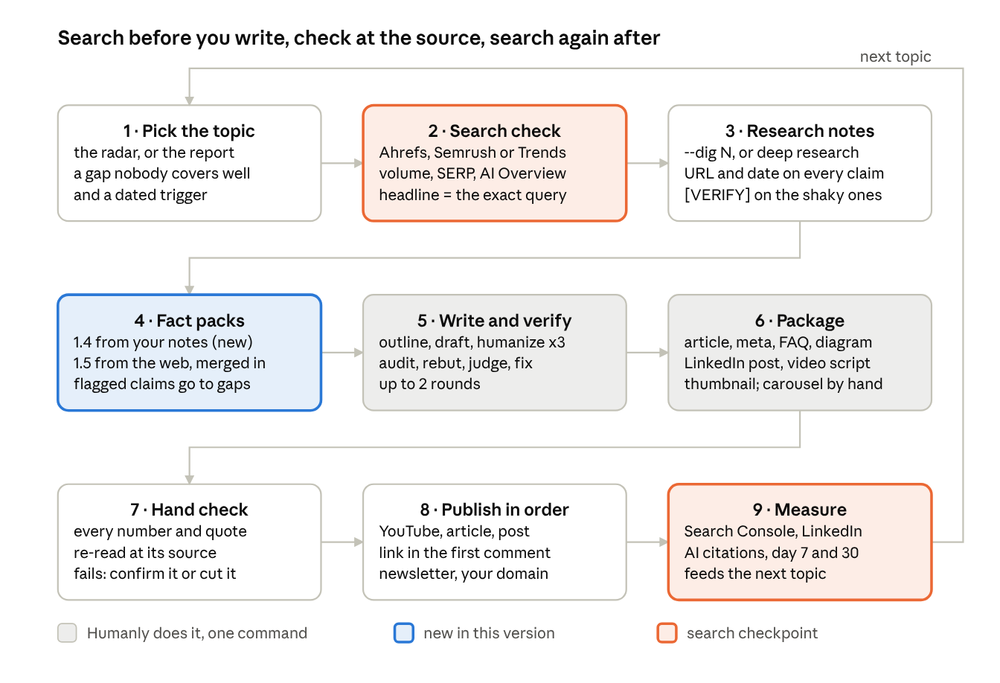
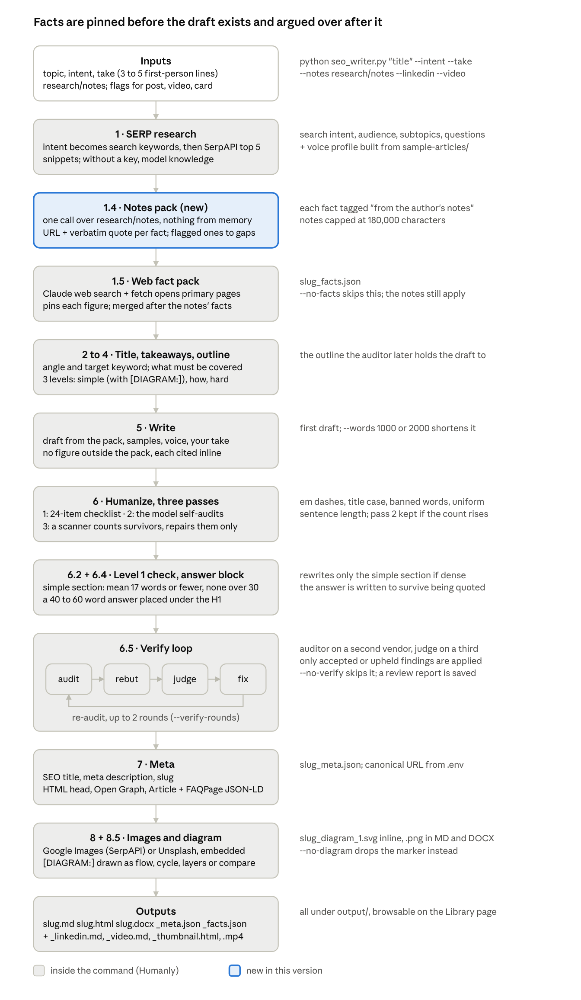
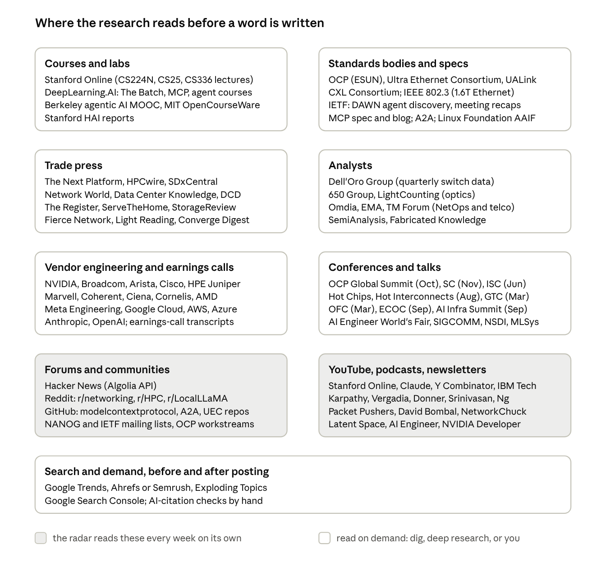

# AI Networking LinkedIn Articles

Oct 2, 2026 · @imran

Three publication-ready pieces from the research, in your newsletter voice, on the top three topics from the ranked report: the four planes of AI networking, KV cache offload as a network hop, and the stateless MCP specification. Each has a LinkedIn article with an SEO headline, an FAQ for AI answer engines and sources, plus a 150-175 word feed post, a 30-60 second captioned video script and a carousel. Facts come only from the sourced research; anything that still needs a check before you quote it is listed near the end.

## Publishing plan

Publish the four-planes piece before OCP Global Summit opens on 12 October so the vocabulary from the keynotes lands on your diagram, the MCP piece in late October, and the agent-memory piece in the run-up to SC26 (15-20 November, Chicago), when the products it names are due to ship.

| Window | Piece | Formats | Why then |
| --- | --- | --- | --- |
| 6-9 Oct | Article 1: four planes | LinkedIn article, 8-slide carousel, 45 s native video, full explainer on YouTube | OCP's networking track lists ESUN 1.0, UALink-SAI and 102.4T switching by name ([OCP](https://www.opencompute.org/blog/explore-22-tracks-at-the-2026-ocp-global-summit)) |
| 13-15 Oct | Article 1 follow-up feed post | Text post, 150-175 words, link to the article in the first comment | React to what OCP announced against your four-plane diagram |
| 20-24 Oct | Article 3: MCP stateless | LinkedIn article, two-column carousel, 30-45 s split-screen video | The only topic with measured search volume ("model context protocol", about 40.5K/month, past peak), no event dependency |
| 3-7 Nov | Article 2: agent memory hop | LinkedIn article, ladder carousel, 60 s "life of a token" video | BlueField-4 STX partner systems, Cornelis CN6000 and the 1.6T ramp are all due in Q4; republish after SC26 with what actually shipped |

The format split follows the 2026 data. Document carousels earn the highest engagement rate (7.00% against 6.00% for video, [Socialinsider](https://www.socialinsider.io/blog/linkedin-benchmark/)), personal profiles earn 63% more engagement than company pages ([Metricool](https://metricool.com/press-release-linkedin-study-2026/)), and reach peaks at 150-175 words for feed posts ([The Shield Index](https://theshieldindex.beehiiv.com/p/does-linkedin-post-length-actually-matter)). For AI answer engines, LinkedIn articles make up 50-66% of LinkedIn citations against 15-28% for feed posts ([Semrush](https://www.semrush.com/blog/linkedin-ai-visibility-study/)), and articles whose headline contains every query word ranked in Google's top 20 for 42.1% of searches against 7.2% otherwise ([Indie Hackers analysis](https://www.indiehackers.com/post/linkedin-seo-5-steps-from-1-260-searches-and-9-805-urls-319753c72c)). One tracker shows LinkedIn's share of AI citations falling from 13.8% to 4.8% between February and July 2026 ([Cloro](https://cloro.dev/blog/linkedin-articles-vs-posts/)), so each article should also live on your newsletter domain and the explainer on YouTube.

Three rules for every piece: the YouTube and article links go in the first comment, never in the post body (link posts have the lowest engagement rate of any format); captions are burned into every video, because most LinkedIn video plays muted; and each post ends on a real design question, since early discussion outperforms likes.

## Workflow: research to publish



Steps 4 to 6 are one command: `python seo_writer.py "<title>" --intent "<angle>" --notes research/notes --take "<your positions>" --linkedin --video --thumbnail`. The two search steps are yours: step 2 before you write (a 30-minute pull of the target phrases, then the exact query in the headline's first 50 characters) and step 9 after you post (Search Console impressions for that query, LinkedIn reach and comments, and whether ChatGPT, Perplexity or Google AI Mode cite you when asked the article's FAQ questions). Nothing is posted until step 7 has re-read every number and quotation at its source; a flagged claim is confirmed or cut, never softened into a hedge.

### What changed from the previous version

| Step | Previous version | Now |
| --- | --- | --- |
| Research input | SERP snippets (SerpAPI) or model memory; the fact pack opened whichever pages the model chose | Your own notes come first: Step 1.4 builds a fact pack from them, nothing from memory, and the web pack is merged in after |
| Unverified claims | A figure that reached the pack could be written as fact | Anything the notes flag \[VERIFY\], secondary source or secondhand goes to the gaps; the writer is told to check it or leave it out |
| Angle | Taken from the SERP analysis | The first part of each note sits above the pack as a digest, so the outline follows your angle |
| Provenance | `<slug>_facts.json` listed web facts only | Each fact from your notes is tagged "from the author's notes" in the pack the writer, outliner and auditor see |
| Inputs | topic, intent, take | plus `--notes` on the CLI and `"notes": [...]` in an API run request, resolved under `research/` |
| Repo | No home for research | `research/` (report and notes), `articles/` (finished pieces), CLAUDE.md rules, `test_notes.py` (30 checks) |

## Pipeline in detail

This is the inside of steps 4 to 6 of the workflow above (one command, twelve stages) and the exact procedure for the four steps that stay yours: the search check, the hand check, publishing and measuring.



Everything above the verify loop decides what the article may say; the loop then argues over whether the draft said it. The notes pack is the only new stage, and it sits before the web pack on purpose: when the two conflict, the fact from your notes wins the cap and the duplicate from the web is dropped.

### Inside the command, stage by stage

| Stage | What happens | Needs | Produces | Skipped or fails when |
| --- | --- | --- | --- | --- |
| Intent to keywords | One call turns the intent into the search phrase | `--intent` and no `--keywords` | the primary keyword | `--keywords` given, or neither (topic is used) |
| 1 SERP research | Top 5 Google snippets for the phrase, then one call: search intent, audience, goal, subtopics, reader questions | `SERPAPI_KEY` (optional) | the research brief | No key: model knowledge, printed as such |
| Style and voice | Loads `sample-articles/` as exemplars and builds a cached voice profile every prose step is held to | your sample articles | `.voice_profile.json` in output/ | Empty folder: no profile |
| 1.4 Notes pack | One call over your notes: every figure with its URL and verbatim quote; flagged or unsourced claims go to gaps; facts tagged with their origin | `--notes` files or folder (under 180,000 characters) | the first fact pack | No `--notes`; a failed call prints a warning and continues |
| 1.5 Web fact pack | Claude web search and fetch opens primary pages and pins each figure; falls back to SerpAPI plus plain HTTP | web tools, else `SERPAPI_KEY` | `<slug>_facts.json` (merged, notes first) | `--no-facts`; no tools and no key: an empty pack and a no-figures rule |
| 2 Title | Picks the angle and target keyword from the research | research | refined title |  |
| 3 Key takeaways | What the article must cover to outrank what ranks | research | takeaways list |  |
| 4 Outline | Three levels: the simple version with a `[DIAGRAM:]` marker, how it works, where it gets hard; section counts follow `--words` | takeaways, length profile | the outline |  |
| 5 Write | Full draft grounded in the research, samples, voice profile, fact pack and your take; no figure outside the pack | all of the above | first draft | Missing `--take`: a loud warning, generic article |
| 6 Humanize | Pass 1 removes patterns against a 24-item checklist; pass 2 self-audits; pass 3 counts the tells that survived and repairs only those phrases | the draft | humanized draft | Pass 3 count rises: pass 2 is kept |
| 6.2 Level 1 check | Measures the simple section (mean 17 words or fewer, none over 30) and rewrites just that section if dense | the `[DIAGRAM:]` section | same draft | No marker survived: a warning |
| 6.4 Answer block | A 40 to 60 word extractable answer placed under the H1 | the draft | same draft |  |
| 6.5 Verify | A second vendor audits against the outline, takeaways and pack; the writer rebuts; a third vendor rules; accepted and upheld findings are applied; re-audit up to `--verify-rounds` | two or three vendor keys | reviewed draft, review report | `--no-verify`; one key: same vendor, weaker check |
| 7 Meta | SEO title, meta description, slug; the HTML gets head, canonical, Open Graph, Article and FAQPage JSON-LD | `.env` publication identity | `<slug>_meta.json` |  |
| 8 Images | Real images from Google Images or Unsplash, embedded in the DOCX | `SERPAPI_KEY` or Unsplash | images in DOCX and HTML |  |
| 8.5 Diagram | The marker becomes a spec (flow, cycle, layers, compare) and is rendered | the marker | `_diagram_1.svg` and `.png` | `--no-diagram` |
| Extras | LinkedIn post, 2 to 3 minute video script, voiceover, rendered MP4 in 16:9 and 9:16 with captions, share card | `--linkedin --video --voiceover --mp4 --thumbnail`, ElevenLabs keys and ffmpeg for audio and video | `_linkedin.md`, `_video.md`, `_voiceover.mp3`, `_video_16x9.mp4`, `_video_9x16.mp4`, `.srt`, `_video_meta.md`, `_thumbnail.html` | Keys missing |

### The four steps that stay yours

**2 · Search check, about 30 minutes before writing.**

1. Take the target phrases from the article's SEO package (five per article above).
2. In Ahrefs or Semrush record volume, 12-month trend and difficulty for each; in Google Trends, the rising related queries.
3. Google each phrase and note three things: whether an AI Overview appears, which domains hold the top five, and what format ranks (explainer, vendor page, video).
4. Choose the one phrase people actually type. Where a networking term has no volume, ride the agent term instead ("AI agentic", "model context protocol").
5. Put that phrase verbatim in the headline's first 50 characters and in the first paragraph; turn the "People also ask" questions you saw into the FAQ headings.
6. Write the numbers into the article's SEO table so step 9 has a baseline.

**7 · Hand check, 30 to 60 minutes after the command finishes.**

1. Open `<slug>_facts.json`. For every fact, open its `source_url`, find the quote on the page, confirm the value and the date.
2. Work the gaps list: each "flagged in the notes" item is confirmed at its URL and promoted to a fact, or cut from the article. Never softened into "around" or "typically".
3. Read every number in the article against the pack; a number that is not in the pack is removed.
4. Re-read every quotation at its source, word for word; the research notes were read through a summariser.
5. Read the review report from step 6.5 and confirm the upheld fixes actually landed in the text.
6. For the three hand-written articles above, split them into separate `.md` files and run `python seo_writer.py --audit articles/<file>.md --intent "<its angle>"` to get the same three-agent review before they go out.

**8 · Publish, in this order.**

1. YouTube first: the explainer, titled with the exact headline, description = key takeaways plus the sources list, chapters per section.
2. LinkedIn article: the exact headline, the answer block as the first paragraph, FAQ headings as questions, sources at the end.
3. Feed post from `_linkedin.md` (150 to 175 words) with the carousel PDF attached; the article and YouTube links go in the first comment; reply to every comment in the first hour.
4. Newsletter edition: your intro block, the article, the course CTA.
5. Mirror on your own domain with the canonical URL the app wrote into the HTML head.
6. Cadence: 2 to 5 posts a week; the follow-up post lands during the event week (OCP 12 to 15 October, SC26 15 to 20 November).

**9 · Measure, at day 7 and day 30.**

1. Google Search Console: impressions, clicks and average position for the headline query and each FAQ question.
2. LinkedIn analytics: impressions, reach, comments against reactions, carousel completion, video view-through.
3. AI citations: ask ChatGPT, Perplexity, Google AI Mode and Copilot the article's four FAQ questions and record whether the article or the video is cited. Expect Google's surfaces to cite first; ChatGPT cited LinkedIn in 0.06% of answers in the latest tracker.
4. YouTube: views, average view duration, traffic sources.
5. Feed it back: mark the radar theme written (`--from-theme`), note which phrase actually drew impressions, and pick the next topic from the gap that showed up in the comments.

## Sources to watch

The backend reads nine kinds of source. Two of them (forums, and the YouTube, podcast and newsletter voices) the radar already reads every week on its own; the other seven are opened on demand by Dig in, by deep research, or by you, and that is where the AI networking numbers actually live.



As of today the radar also tracks Stanford Online, the Claude channel, IBM Technology, NVIDIA Developer, Open Compute Project, David Bombal and NetworkChuck on YouTube, Packet Pushers among the podcasts, The Next Platform, HPCwire, SemiAnalysis and Dell'Oro among the voices, r/networking and r/HPC on Reddit, and five Hacker News queries (InfiniBand, Ultra Ethernet, NVLink, MCP, data center networking). The handles were checked to resolve; Packet Pushers has no handle the radar could read, so it rides the podcast list. Each addition is marked "AI networking pillar" in `seo_writer.py`, so any that crowd out the agent-builder channels can be removed in one line.

| Zone | Sources | What to take from them | Read by | Touched in this research |
| --- | --- | --- | --- | --- |
| Courses and labs | [Stanford Online](https://www.youtube.com/@stanfordonline) (CS224N, CS25, CS336 lectures), [DeepLearning.AI](https://www.deeplearning.ai/the-batch/) (The Batch, short courses on MCP and agents), Berkeley's agentic AI MOOC, MIT OpenCourseWare, Stanford HAI | The framing your readers already share; what the curricula still skip (none of them teach the fabric) | Radar (YouTube); you | DeepLearning.AI yes; Stanford Online no (YouTube was unreadable) |
| Standards bodies and specs | [OCP](https://www.opencompute.org/) (ESUN workstream, summit tracks), [Ultra Ethernet Consortium](https://ultraethernet.org/), UALink Consortium, [CXL Consortium](https://computeexpresslink.org/), IEEE 802.3, [IETF](https://www.ietf.org/blog/) (DAWN), [MCP spec and blog](https://blog.modelcontextprotocol.io/), A2A, Linux Foundation AAIF | Dated spec releases, membership counts, header formats, what was and was not chartered; the primary source for every "spec vs silicon" claim | Dig; deep research | Yes: OCP, UEC, CXL, IETF, MCP |
| Trade press | [The Next Platform](https://www.nextplatform.com/), [HPCwire](https://www.hpcwire.com/), [SDxCentral](https://www.sdxcentral.com/), [Network World](https://www.networkworld.com/), [Data Center Knowledge](https://www.datacenterknowledge.com/), DCD, The Register, ServeTheHome, StorageReview, Fierce Network, Light Reading, Converge Digest | The week's announcements with numbers and named people; the quotes; always follow their link to the vendor primary | Dig; deep research | Yes, eleven of them |
| Analysts | [Dell'Oro Group](https://www.delloro.com/) (quarterly switch data), [650 Group](https://650group.com/), LightCounting (optics), Omdia, EMA, TM Forum, SemiAnalysis, Fabricated Knowledge | Market shares, crossovers (back-end over front-end), forecasts; the only non-vendor numbers in the field | Deep research; you | Dell'Oro, 650 Group, Omdia (via Cisco), EMA, TM Forum (via Fierce) |
| Vendor engineering and earnings calls | NVIDIA (developer blog, perspectives), Broadcom, [Arista](https://blogs.arista.com/), [Cisco](https://blogs.cisco.com/), HPE Juniper, Marvell, Coherent, Ciena, Cornelis, AMD, Meta Engineering, Google Cloud, AWS, Azure, Anthropic, OpenAI; call transcripts | Product dates and claims, labelled as vendor claims; executives' own words (Ullal, Shainer, Boujelbene) | Dig; fact pack (web pass) | Yes, plus Arista and Broadcom call transcripts |
| Conferences and talks | OCP Global Summit (Oct), SC (Nov), ISC (Jun), Hot Chips and [Hot Interconnects](https://hoti.org/) (Aug), GTC (Mar), OFC (Mar), ECOC (Sep), AI Infra Summit (Sep), AI Engineer World's Fair, Cisco Live, NANOG, SIGCOMM, NSDI, MLSys | The calendar hooks; programmes name the topics six weeks early; recordings are the only video on fabrics | You | OCP tracks, HOTI programme, SC26, AI Engineer rankings |
| Forums and communities | Hacker News, Reddit (r/networking, r/HPC, r/LocalLLaMA, r/MachineLearning), GitHub (modelcontextprotocol, A2A, UEC), NANOG and IETF mailing lists, OCP workstreams | What practitioners push back on; the small repos that show a threat model exists before anyone writes it up | Radar (weekly) | GitHub only (netverify, paperclip) |
| YouTube, podcasts, newsletters | [Stanford Online](https://www.youtube.com/@stanfordonline), [Claude](https://www.youtube.com/@claude), [Y Combinator](https://www.youtube.com/@ycombinator), [IBM Technology](https://www.youtube.com/@IBMTechnology), Karpathy, [Priyanka Vergadia](https://www.youtube.com/@pvergadia), [Ed Donner](https://www.youtube.com/@Edward.Donner), [Aishwarya Srinivasan](https://www.youtube.com/@aishwaryasrinivasan), Andrew Ng, [Packet Pushers](https://packetpushers.net/), [David Bombal](https://www.youtube.com/@davidbombal), [NetworkChuck](https://www.youtube.com/@NetworkChuck), Latent Space, AI Engineer, [NVIDIA Developer](https://www.youtube.com/@NVIDIADeveloper), [Open Compute Project](https://www.youtube.com/@opencompute) | The mental models and vocabulary the audience arrives with; the gaps (nobody draws the fabric); the X vs Y title form that works | Radar (weekly) | Partly: creators' own sites and third-party write-ups; YouTube itself returned 429s |
| Search and demand | Google Trends, Ahrefs or Semrush, [Exploding Topics](https://explodingtopics.com/), Google Search Console, [Semrush's AI visibility study](https://www.semrush.com/blog/linkedin-ai-visibility-study/), [Cloro](https://cloro.dev/blog/linkedin-articles-vs-posts/) | Volume and trend before writing; impressions and AI citations after | You, before and after each piece | Exploding Topics, Semrush, Cloro |

### Showcase: the research behind the posts

The honest numbers, counted from the files in `research/`: 4 research streams, 156 unique URLs across 102 domains, 16,321 words of notes, 10 topics ranked, 3 articles written, 12 claims marked `[VERIFY]` and 10 marked secondhand, none of which went into an article as fact.

**Feed post (168 words, link in the first comment).**

Before I wrote one line of the AI networking series, here is what the research looked like.

4 research streams. 156 unique sources across 102 domains. 16,000 words of notes. 10 topics ranked. 3 articles.

Every number in the notes carries a URL and a date. 12 claims are marked \[VERIFY\] because the source was secondhand or the page was read through a summariser. They are listed, not hidden, and none of them went into an article as fact.

What the backend reads: standards bodies (OCP, Ultra Ethernet, UALink, CXL, IETF), analysts (Dell'Oro, 650 Group), trade press (The Next Platform, HPCwire, SDxCentral), vendor engineering blogs and earnings calls, and the people who teach this: Stanford Online, DeepLearning.AI, Karpathy, The Cloud Girl, Ed Donner.

Then the pipeline argues with itself. A second model audits the draft, the writer rebuts, a third rules.

Source map and pipeline in the comments.

Which source do you trust for AI infrastructure numbers, and which one have you stopped trusting?

**Carousel (7 slides).** 1 Cover: "What happens before I publish" with the five numbers. 2 The source map above. 3 The 9-step workflow. 4 The pipeline inside the command. 5 "12 claims I flagged and did not use": the $1.2B Arista scale-across target, AMD Helios at 260 TB/s, CScale's $145M, the 7.2 Tb/s secure-traffic figure, each with its URL. 6 The verify loop: audit, rebut, judge, fix. 7 The question, and the links.

**Video (30 to 45 seconds, screen recording, captions burned in).** The `research/notes` folder opens; the terminal runs the command with `--notes`; the STEP 1.4 line prints ("Notes pack: N facts from M URLs; K flagged claims routed to gaps"); `_facts.json` scrolls, each fact with its URL and quote; the review report shows a finding the writer disputed and the judge upheld; the published article's sources list closes it. Caption on the last frame: "Every number has a URL. The ones that don't are listed, not used."

## Article 1: Scale-up vs scale-out vs scale-across vs scale-in: AI networking explained

Headline (query words in the first 50 characters): **Scale-up vs scale-out vs scale-across vs scale-in: AI networking explained**. Slug: `scale-up-vs-scale-out-vs-scale-across-vs-scale-in-ai-networking-explained`. Meta description (149 characters): *The four planes of AI networking in one page: what scale-up, scale-out, scale-across and NVIDIA's new scale-in mean, who sells what, and the 2026 numbers.* About 1,250 words. The article body starts below the line.

---

Every agent explainer I read this year ends at the model's API. Some of mine did too. Priyanka Vergadia's walkthrough of how NVIDIA GPUs work is the best one-GPU explainer I know, and it stops at one GPU ([The Cloud Girl](https://www.thecloudgirl.dev/how-nvidia-gpus-power-the-ai-revolution/)). This is the page after that one.

AI networking in 2026 has four planes. Scale-up is the fabric inside a rack that makes 72 GPUs behave like one computer. Scale-out is the leaf-spine network that joins racks into a cluster. Scale-across joins clusters in different buildings. Scale-in, a term NVIDIA introduced on 29 September 2026, is the path by which users, agents and storage enter the AI factory under security controls ([SiliconANGLE](https://siliconangle.com/2026/09/29/nvidias-scale-in-play-controlling-agents-is-the-next-infrastructure-priority)).

Here is why this matters now. In Q2 2026 the switches behind the GPUs out-sold the entire front-end data centre switch market for the first time, according to Dell'Oro, and that back-end market is three years old ([Dell'Oro](https://www.delloro.com/news/ai-back-end-networks-switch-sales-surpass-front-end-networks-for-the-first-time-in-2q2026/)). If you build agents, the fabric is now a bigger line item than the network your users connect through.

### Scale-up: the rack as one computer

Scale-up is the plane with the fight. NVIDIA's NVLink and NVSwitch own it today, and two open camps want in: UALink and Ethernet.

UALink published its 2.0 specification on 7 April 2026 before any 1.0 silicon had shipped. The first 1.0 lab samples are due in the second half of 2026 and products in 2027, and the consortium's chair, Kurtis Bowman, said parity with NVIDIA arrives around version 3.0 ([The Register](https://www.theregister.com/2026/04/07/ualink_2_specs/)). I find that timeline honest and a little alarming at the same time.

Ethernet got to deployment first. OCP's ESUN workstream grew from 12 founders in October 2025 to more than 175 companies by the time its 1.0 specification shipped in March 2026, and the spec replaces the 28 to 48 bytes of IP and UDP headers with a 4-byte header, because scale-up traffic is millions of tiny messages that cannot afford the overhead ([OCP](https://www.opencompute.org/blog/the-ocp-esun-10-specification-has-been-released)). Broadcom told investors on 9 September that Tomahawk Ultra scale-up deployments started in its fiscal third quarter in both GPU and XPU clusters, and that adoption "surprised us" ([Broadcom Q3 FY2026 call](https://www.fool.com/earnings/call-transcripts/2026/09/09/broadcom-avgo-q3-2026-earnings-call-transcript/)).

The number for this plane: 650 Group expects scale-up switching alone to pass $30 billion a year by 2030 ([650 Group](https://650group.com/blog/in-the-ai-era-ethernet-set-to-surge-in-scale-out-and-ramp-in-scale-up/)).

### Scale-out: where InfiniBand and Ethernet compete

Scale-out is a flat, two-tier leaf-spine fabric, as Arista's Jayshree Ullal and Hardev Singh described it in May, with the serialisers moving from 112G to 224G per lane and 448G next ([Arista](https://blogs.arista.com/blog/the-many-facets-of-ai-fabrics)).

Ethernet is about two thirds of AI cluster switch sales. InfiniBand switch sales still tripled in the first quarter of 2026, mostly from upgrades of existing clusters ([SDxCentral](https://www.sdxcentral.com/news/ethernet-dominates-ai-networking-as-switch-sales-double-but-infiniband-rebounds/)). Both are growing. The constraint is supply: 800G is the vast majority of what ships, 1.6T is only sampling, and Dell'Oro expects shortages to last one to two years ([Dell'Oro](https://www.delloro.com/news/ai-back-end-networks-switch-sales-surpass-front-end-networks-for-the-first-time-in-2q2026/)).

This is also the plane where optics moved inside the switch. NVIDIA's Spectrum-X Photonics co-packaged optics switches were reported in full production on 15 August, with vendor claims of four times fewer lasers and five times lower power ([StorageReview](https://www.storagereview.com/news/nvidia-spectrum-x-ethernet-photonics-enters-full-production-with-4x-fewer-lasers-and-a-five-vendor-cpo-supply-chain)). The physics forces it: passive copper reaches 2 to 3 metres at 800G, about 1 metre at 1.6T and under 1 metre at 3.2T, according to a sponsored AvidThink brief ([AvidThink](https://cdn.asp.events/CLIENT_Kisaco_R_E0D4AD69_B740_B124_D2ADF5A777880773/sites/AI-Infra-Summit-2026/media/libraries/sponsor-editorial/9372-2026-ngi-data-center-networking-report-rev-a3-1-.pdf)).

The number for this plane: Cisco's Silicon One G300 switches 102.4 terabits per second in one chip ([Data Center Knowledge](https://www.datacenterknowledge.com/networking/ai-data-center-networking-scaling-up-out-and-across-with-102-4t-ethernet)).

### Scale-across: clusters that span buildings

Scale-across joins clusters in different halls or cities, because one building no longer holds enough power for one training job. Cisco positions its 51.2 Tbps P200 here, built for long links ([Data Center Knowledge](https://www.datacenterknowledge.com/networking/ai-data-center-networking-scaling-up-out-and-across-with-102-4t-ethernet)), and Ciena is bringing coherent optics for the same plane to OCP ([Ciena](https://www.ciena.com/about/newsroom/press-releases/ciena-showcases-ai-ready-connectivity-expertise-for-scale-up-scale-out-and-scale-across-connectivity-at-ocp-global-summit-2026)).

Dell'Oro's Sameh Boujelbene has the line that explains why anyone bothers. When the network cannot keep the accelerators busy, buyers "did not buy an AI supercomputer; they bought an expensive collection of stranded chips" ([Data Center Knowledge](https://www.datacenterknowledge.com/networking/ai-data-center-networking-scaling-up-out-and-across-with-102-4t-ethernet)).

### Scale-in: your agents are now network tenants

Scale-in is NVIDIA's name for the plane nobody had drawn: the path users, agents and storage take into the factory. NVIDIA's Gilad Shainer put the reason plainly on 29 September: "agent is not just one inference call. There are many inference calls." The BlueField-4 DPU sits on this plane, enforcing controls on agent traffic outside the workload and fronting the storage that holds an agent's working memory. His other line is the one I keep coming back to: "You cannot count on an agent to contain itself" ([SiliconANGLE](https://siliconangle.com/2026/09/29/nvidias-scale-in-play-controlling-agents-is-the-next-infrastructure-priority)).

For agent builders, this is the plane you actually touch. Every subagent hand-off, every MCP tool call and every retrieval is a hop across it. Whether "scale-in" survives as an industry term or stays NVIDIA marketing, the plane it names is real.

### The four planes on one page

| Plane | What it joins | 2026 technologies | Who defines it | One number |
| --- | --- | --- | --- | --- |
| Scale-up | GPUs inside a rack | NVLink and NVSwitch; ESUN on Broadcom Tomahawk Ultra; UALink 1.0 (lab samples H2 2026) | OCP ESUN workstream, UALink Consortium | 4-byte ESUN header replaces 28-48 bytes |
| Scale-out | Racks into a cluster | 800G Ethernet (Spectrum-X, Tomahawk 6, Arista Etherlink), InfiniBand, co-packaged optics | Ultra Ethernet Consortium, IEEE 802.3 | Back-end switch sales passed front-end in Q2 2026 |
| Scale-across | Clusters across sites | Cisco P200 (51.2 Tbps), coherent optics | No single body yet | 51.2 Tbps per chip |
| Scale-in | Users, agents and storage into the factory | BlueField-4 DPU, OpenShell runtime | NVIDIA (vendor term, 29 Sep 2026) | "Many inference calls" per agent task |

### What to watch at OCP next week

OCP Global Summit runs 12-15 October in San Jose. The networking track lists ESUN 1.0, UALink-SAI, MetaRoCE, optical circuit switching and 102.4T liquid-cooled switching by name ([OCP](https://www.opencompute.org/blog/explore-22-tracks-at-the-2026-ocp-global-summit)). Every one of those maps onto a ring in the diagram above. If you take one thing into the keynotes, take the diagram.

### My take

The agent community describes its systems with an org chart: an orchestrator, workers, a board that approves. The infrastructure community describes the same system with a network map: planes, hops, trust boundaries. The second description is the one that tells you why your agent is slow, and I would rather we learned it before the vendors hand us their version.

Which plane is your bottleneck today, and do you actually know?

### Key takeaways

- AI networking has four planes in 2026: scale-up (inside the rack), scale-out (across racks), scale-across (across sites) and scale-in (users, agents and storage entering the factory).
- Back-end AI switch sales passed front-end switch sales for the first time in Q2 2026 (Dell'Oro).
- Ethernet reached scale-up deployment before UALink shipped 1.0 silicon; UALink 2.0 was published on 7 April 2026 with 1.0 products due in 2027.
- Copper's reach drops from 2-3 m at 800G to about 1 m at 1.6T, which is why co-packaged optics entered production in 2026.
- NVIDIA introduced "scale-in" on 29 September 2026 with BlueField-4 as the control point for agent traffic.

### FAQ

**What is scale-up networking?** The fabric inside a rack that connects GPUs at memory-like speeds so they behave as one computer. NVLink is the incumbent; ESUN (Ethernet) and UALink are the open alternatives.

**What is the difference between scale-up and scale-out?** Scale-up joins GPUs inside one rack over very short, very fast links. Scale-out joins racks into a cluster over a leaf-spine Ethernet or InfiniBand fabric.

**What is scale-in?** NVIDIA's term, introduced on 29 September 2026, for the plane that brings users, agents and storage into the AI factory under security controls enforced by the BlueField-4 DPU.

**Is InfiniBand dead?** No. Ethernet is about two thirds of AI cluster switch sales, but InfiniBand switch sales tripled in Q1 2026, mostly from upgrades of existing clusters.

## Article 1 kit: feed post, video, carousel, SEO and GEO

### Feed post (162 words, link in the first comment)

Scale-up, scale-out, scale-across. And as of last week, scale-in.

Four planes. One page. No vendor slides.

Most agent explainers end at the model's API. The best GPU explainer I know ends at one GPU. Nobody in that group draws what happens next, so I did.

Scale-up joins 72 GPUs into one computer. NVLink owns it. Ethernet (ESUN) took the first open deployments. UALink published version 2.0 before a single 1.0 chip shipped.

Scale-out joins racks. Ethernet is two thirds of it. InfiniBand still tripled in Q1.

Scale-across joins buildings. 51.2T chips and coherent optics.

Scale-in is NVIDIA's new word for the path your agents, users and storage take into the factory. Gilad Shainer: "agent is not just one inference call."

In Q2 the switches behind the GPUs out-sold the entire front-end market. That market is three years old.

Full article, diagram and every source in the first comment.

Which plane is your bottleneck today, and do you actually know?

### Video script (45 seconds, captions burned in, 1:1 for the feed and 9:16 for Shorts)

| Time | On screen | Caption text | Voice-over |
| --- | --- | --- | --- |
| 0-3 s | One GPU in the centre; four rings draw around it in under two seconds | 4 planes of AI networking | Every AI network has four planes. Here they are in 45 seconds. |
| 3-12 s | Ring 1 lights up; a rack of 72 GPUs | SCALE-UP. Inside the rack. NVLink, ESUN, UALink | Scale-up joins the GPUs inside one rack into one computer. NVLink today. Ethernet took the first open deployments. UALink's chips arrive next year. |
| 12-21 s | Ring 2; racks join into a leaf-spine hall | SCALE-OUT. Across racks. 800G Ethernet or InfiniBand | Scale-out joins racks into a cluster. Ethernet is two thirds of it, InfiniBand still tripled, and copper only reaches about one metre at 1.6T, so the optics move into the switch. |
| 21-29 s | Ring 3; two buildings linked by a fibre line | SCALE-ACROSS. Across sites. 51.2T chips, coherent optics | Scale-across joins buildings, because one hall no longer holds enough power for one job. |
| 29-38 s | Ring 4; a user icon and an agent icon walk in through a DPU gate | SCALE-IN. Agents, users, storage. BlueField-4 (NVIDIA, 29 Sep 2026) | Scale-in is NVIDIA's new term for how agents, users and storage enter the factory. Every tool call your agent makes crosses this plane. |
| 38-45 s | All four rings; stat card | Q2 2026: back-end switch sales passed front-end (Dell'Oro) | In Q2 the network behind the GPUs out-sold the network in front of them. Full article in the comments. |

Production notes: one colour per plane, and the same four colours carry into the carousel. The diagram is on screen from the first frame because median LinkedIn watch time is a few seconds. Thumbnail: the four rings with the words "4 planes".

### Carousel (8 slides, 1080 x 1350, posted as a PDF document; caption under three lines)

1. Cover: "AI networking has 4 planes. Most agent explainers draw none of them." Four rings around one GPU.
2. Scale-up, inside the rack: NVLink, ESUN (Ethernet), UALink. "UALink 2.0 spec: 7 Apr 2026. First 1.0 chips: 2027."
3. Scale-out, across racks: 800G Ethernet or InfiniBand. "Ethernet about two thirds of sales. InfiniBand 3x in Q1 2026."
4. Why optics moved into the switch: copper reach ladder, 800G 2-3 m, 1.6T about 1 m, 3.2T under 1 m (AvidThink brief, sponsored).
5. Scale-across, across sites: Cisco P200 at 51.2 Tbps, coherent optics.
6. Scale-in, agents and users and storage into the factory: BlueField-4. Quote card: "You cannot count on an agent to contain itself." Gilad Shainer, NVIDIA, 29 Sep 2026.
7. The number: Q2 2026, back-end AI switch sales passed front-end for the first time (Dell'Oro, 3 Sep 2026).
8. Close: "Which plane is your bottleneck?" plus "Full article and sources in the comments" and your newsletter name.

Carousel caption: "Four planes of AI networking, one per slide. Scale-up, scale-out, scale-across and NVIDIA's new scale-in. Sources in the comments."

### SEO and GEO package

| Item | Value |
| --- | --- |
| Title tag (73 characters) | Scale-up vs scale-out vs scale-across vs scale-in: AI networking explained |
| Slug | scale-up-vs-scale-out-vs-scale-across-vs-scale-in-ai-networking-explained |
| Meta description | The four planes of AI networking in one page: what scale-up, scale-out, scale-across and NVIDIA's new scale-in mean, who sells what, and the 2026 numbers. |
| Target queries (volumes not yet measured; pull them in Ahrefs, Semrush or Google Trends before publishing) | scale-up vs scale-out networking; AI networking explained; scale-across AI data center; scale-in NVIDIA; NVLink vs Ethernet scale-up |
| GEO traits already in the article | Definition in the first 150 words; five dated numbers; two named quotations; four question-form FAQ headings; sources list; publish date in the text |
| Where it lives | LinkedIn article with the exact headline; newsletter edition with your intro block prepended; YouTube explainer with the same title and the key takeaways as the description; mirror on your own domain |
| Hashtags (three at most) | #AINetworking #AIInfrastructure #AgenticAI |

## Article 2: KV cache offload explained: your AI agent's memory now lives one network hop away

Headline (query words in the first 50 characters): **KV cache offload explained: your AI agent's memory now lives one network hop away**. Slug: `kv-cache-offload-explained-agent-memory-network-hop`. Meta description (152 characters): *KV cache offload in 2026: BlueField-4 STX, CXL pools and in-fabric compute now put your agent's working memory one network hop away. What it does to latency.* About 1,200 words. This one follows your earlier newsletter piece on KV caching and speculative decoding. The article body starts below the line.

---

When I wrote about KV caching and speculative decoding in this newsletter, it was a GPU memory trick. In 2026 it is a storage product, a memory standard and a networking startup's pitch, and all three moved between August and September.

Your agent's working memory no longer lives in the GPU. It lives one network hop away, and that hop now sets your time to first token.

### What the KV cache is, in one paragraph

Every token a transformer processes produces a key and a value for every attention layer, and the model keeps them so it does not recompute the whole context for each new token. That store is the KV cache. For a chat it is small and short-lived. For an agent that runs for an hour, carries a long tool history and calls a model dozens of times per task, it is the largest thing the system has to keep somewhere, and keeping it in HBM means fewer concurrent sessions per GPU.

### Three layers now compete to hold it

**The DPU and the storage fabric.** NVIDIA's BlueField-4 STX architecture moves the KV cache to an accelerated storage tier that the GPU reaches by RDMA over Spectrum-X Ethernet, bypassing the host CPU. NVIDIA claims five times higher token throughput, and partner systems from DDN, Dell, HPE, IBM, NetApp and VAST are due in late 2026 ([3DTested](https://www.3dtested.com/tech-industry/nvidia-launches-bluefield-4-stx-storage-architecture-for-agentic-ai)); the platform now carries the CMX name ([NVIDIA](https://www.nvidia.com/en-us/data-center/ai-storage/cmx/)). On 29 September NVIDIA folded this into what it calls "scale-in", with the DPU as the control point for agent traffic. Gilad Shainer's reason: "agent is not just one inference call. There are many inference calls" ([SiliconANGLE](https://siliconangle.com/2026/09/29/nvidias-scale-in-play-controlling-agents-is-the-next-infrastructure-priority)).

**The memory bus.** The CXL Consortium used the Future of Memory and Storage show on 4-6 August to pitch "memory-tiering via KV Cache offloading" as the way to "increase tokens-per-dollar": a pool of DRAM behind a CXL link, closer than flash and cheaper than HBM ([CXL Consortium](https://computeexpresslink.org/blog/increase-tokens-per-dollar-with-cxl-at-future-of-memory-and-storage-2026-4762/)).

**The network itself.** Cornelis raised about $205 million in mid-September to put RISC-V compute into NICs and switches, so the fabric can accelerate KV-cache handling and route mixture-of-experts traffic. Its CEO, Lisa Spelman, cited GPU utilisation of roughly 42-54% in production and a target of five to ten points of improvement ([Network World](https://www.networkworld.com/article/4221872/cornelis-lands-205m-to-make-ai-networks-compute-not-just-connect.html)).

Cisco's framing from July fits all three. Inference latency is dominated today by GPU queuing and prompt processing, "network latency becomes the next frontier", and agentic applications are "chattier", with one user task triggering tens or hundreds of sequential calls between agents, models, tools and data ([Cisco](https://blogs.cisco.com/sp/why-ai-inference-is-becoming-a-networking-issue)).

### The memory ladder

| Tier | Distance from the GPU | Who sells it | Status, October 2026 |
| --- | --- | --- | --- |
| HBM on the GPU | None | NVIDIA, AMD | Shipping; the scarce resource |
| Host DRAM | PCIe | Every server vendor | Shipping; the CPU sits in the path |
| CXL memory pool | A CXL link | CXL Consortium members | Pitched for KV cache at FMS, August 2026 |
| DPU-fronted flash (BlueField-4 STX, CMX) | One RDMA hop over Spectrum-X | NVIDIA with DDN, Dell, HPE, IBM, NetApp, VAST | Partner systems due late 2026 (vendor claim) |
| Compute in the NIC and the switch | The hop itself | Cornelis | $205M raised September 2026; CN6000 wider availability in Q4 |

Every rung down the ladder trades concurrency for latency: more sessions per GPU, more microseconds per token. Every number in that table is a vendor claim until someone publishes a benchmark. I looked for an independent one. I could not find it.

### Why agent builders should care

Andrew Ng's The Batch ran "DeepSeek Shrinks Caches" on 2 October ([The Batch 373](https://www.deeplearning.ai/the-batch/issue-373)), and a week earlier noted that Devin Fusion keeps separate contexts for its lead model and its sidekick model so that each one's prompt cache stays warm ([The Batch 372](https://www.deeplearning.ai/the-batch/issue-372)). Both are software answers to the same hardware question: where does the context live, and how far away is it?

Andrej Karpathy has been describing the context window as the new programming surface. If that is right, the KV cache is its RAM, and in 2026 that RAM is on the network. Nobody in the agent-building world is drawing the hop. Nobody selling the hop is talking to agent builders.

### What I would do this quarter

1. Measure time to first token against context length on your current stack, at p50 and p95, before any offload product arrives. You need the baseline.
2. Pin long-running agent sessions to the replica that holds their cache. The moment you round-robin them across replicas, every hop is a cache miss.
3. Separate the lead model's context from the sidekick's, as Devin Fusion does, so each cache stays warm.
4. Ask every vendor for p95 time to first token with the cache on the far side of the hop, and for concurrent sessions per GPU. Those two numbers decide the economics, and nobody has published them yet.

Where does your agent's KV cache live today, and have you ever measured the hop?

### Key takeaways

- The KV cache is an agent's working memory, and in 2026 three layers compete to hold it: DPU-fronted storage (NVIDIA BlueField-4 STX, now CMX), CXL memory pools, and compute inside the NIC and switch (Cornelis).
- NVIDIA claims five times higher token throughput from STX; partner systems from DDN, Dell, HPE, IBM, NetApp and VAST are due in late 2026.
- Cornelis raised about $205M in September 2026 and cites production GPU utilisation of roughly 42-54%.
- Cisco says inference latency is dominated by GPU queuing today and that network latency is the next bottleneck.
- No independent benchmark of any KV cache offload product was available as of October 2026.

### FAQ

**What is KV cache offload?** Moving the attention keys and values a model keeps for a conversation out of GPU memory into a cheaper tier (host DRAM, a CXL pool or flash behind a DPU) so a GPU can serve more sessions, at the cost of the time it takes to fetch them back.

**What is NVIDIA BlueField-4 STX?** A storage architecture, now marketed as CMX, in which the BlueField-4 DPU fronts a flash tier that holds the KV cache and serves it to GPUs by RDMA over Spectrum-X Ethernet, bypassing the host CPU. NVIDIA claims five times higher token throughput; partner systems are due in late 2026.

**Does CXL help LLM inference?** The CXL Consortium's August 2026 pitch is that a CXL memory pool holds offloaded KV cache more cheaply than HBM and closer than flash, raising tokens per dollar. Independent measurements were not available as of October 2026.

**Why does the network affect time to first token?** When the cache for a session sits across a network hop, the first token cannot be generated until the keys and values have crossed it. The farther the tier, the longer the wait, which is why Cisco calls network latency the next inference bottleneck.

## Article 2 kit: feed post, video, carousel, SEO and GEO

### Feed post (166 words, link in the first comment)

Your agent's memory doesn't live in the GPU any more.

It lives one network hop away. And that hop now sets your time to first token.

When I first wrote about KV caching here, it was a GPU memory trick. In the last eight weeks it became three products.

NVIDIA BlueField-4 STX puts the cache on flash behind a DPU, reached by RDMA. Claimed 5x token throughput. Partner systems from DDN, Dell, HPE, IBM, NetApp and VAST due late 2026.

The CXL Consortium pitched "KV cache offloading" into memory pools at FMS in August.

Cornelis raised $205M in September to put compute into the NIC and the switch, citing GPU utilisation of 42-54% in production.

Cisco's line: GPU queuing dominates inference latency today, and "network latency becomes the next frontier."

Every one of those numbers is a vendor claim. I looked for an independent benchmark. There isn't one yet.

Full article, the memory ladder and sources in the first comment.

Where does your agent's KV cache live today, and have you ever measured the hop?

### Video script: "Life of a token" (60 seconds, captions burned in, running timer in the corner)

| Time | On screen | Caption text | Voice-over |
| --- | --- | --- | --- |
| 0-3 s | A prompt lands on a GPU; a millisecond timer starts in the corner | Life of a token, 2026 edition | Here is what happens to your agent's next token in 2026. |
| 3-12 s | The GPU searches HBM for the session's cache; MISS flashes | HBM full. Cache miss. | The GPU looks for the session's cache in HBM. HBM is full, because you run forty sessions per GPU, so the cache was evicted. |
| 12-22 s | Drop to host DRAM with a CPU block in the path; timer climbs | Host DRAM: the CPU sits in the path | It drops to host memory. Cheaper, but the CPU is in the path and the timer keeps running. |
| 22-36 s | The request crosses an RDMA link to flash behind a BlueField-4; keys and values stream back | One RDMA hop over Spectrum-X. BlueField-4 STX. NVIDIA claim: 5x throughput | Or it crosses the network: one RDMA hop to flash behind a DPU, no CPU involved. NVIDIA claims five times the token throughput. That is a claim, not a measurement. |
| 36-46 s | Two alternative branches light up: a CXL pool, and a switch with a chip inside it | CXL pool (Aug 2026). Compute in the switch: Cornelis, $205M (Sep 2026) | Two more layers want the same job: CXL memory pools, and Cornelis, which just raised 205 million dollars to put compute into the switch. |
| 46-55 s | The first token appears; the timer freezes on a question mark | Time to first token = the hop | The first token appears when the cache finishes crossing the hop. That hop is your time to first token now. |
| 55-60 s | End card | Every number here is a vendor claim until someone publishes a benchmark | Every number here is a vendor claim until someone publishes a benchmark. Article in the comments. |

Production notes: the timer is the story, so it stays visible in every shot. Use the same tier colours as the carousel ladder. Thumbnail: a GPU, an arrow, a flash box, and the words "one hop away".

### Carousel (8 slides, 1080 x 1350, PDF document post)

1. Cover: "Your agent's memory now lives one network hop away." A GPU, an arrow, a flash box.
2. What the KV cache is: the keys and values for every token in the context. The agent's working memory.
3. Rungs 1 and 2: HBM on the GPU (the scarce resource) and host DRAM (the CPU sits in the path).
4. Rung 3: CXL memory pool. "KV cache offloading to increase tokens-per-dollar." CXL Consortium, FMS, August 2026.
5. Rung 4: DPU-fronted flash. BlueField-4 STX, now CMX. RDMA over Spectrum-X. Vendor claim: 5x token throughput. Partners DDN, Dell, HPE, IBM, NetApp, VAST, late 2026.
6. Rung 5: compute in the NIC and the switch. Cornelis, $205M, September 2026. Production GPU utilisation 42-54% (CEO Lisa Spelman).
7. Quote card: "network latency becomes the next frontier." Cisco, 23 July 2026.
8. Close: "Measure the hop before you buy it." The four questions to ask a vendor (p50 and p95 time to first token across the hop, sessions per GPU, cost per million tokens, cache hit rate). "Article and sources in the comments."

Carousel caption: "Where does your agent's KV cache live? The 2026 memory ladder, one rung per slide. Sources in the comments."

### SEO and GEO package

| Item | Value |
| --- | --- |
| Title tag (83 characters) | KV cache offload explained: your AI agent's memory now lives one network hop away |
| Slug | kv-cache-offload-explained-agent-memory-network-hop |
| Meta description | KV cache offload in 2026: BlueField-4 STX, CXL pools and in-fabric compute now put your agent's working memory one network hop away. What it does to latency. |
| Target queries (volumes not yet measured; "AI agentic" is about 3.6K/month and rising, so the agent terms carry the demand) | KV cache offload; agentic inference infrastructure; BlueField-4 STX; context memory storage; time to first token network latency |
| GEO traits already in the article | Definition paragraph under its own heading; a five-row comparison table; four vendor claims each labelled as claims; three named quotations; four question-form FAQ headings; sources list |
| Where it lives | LinkedIn article; newsletter edition, positioned as the sequel to your KV caching piece; YouTube explainer titled with the same headline; mirror on your domain; republish after SC26 with whichever STX partner systems actually shipped |
| Hashtags | #AgenticAI #AIInfrastructure #LLMInference |

## Article 3: MCP stateless: why the Model Context Protocol dropped sessions

Headline (the 40.5K/month query sits inside the first 50 characters): **MCP stateless: why the Model Context Protocol dropped sessions**. Slug: `mcp-stateless-model-context-protocol-dropped-sessions`. Meta description (152 characters): *The 2026-07-28 Model Context Protocol spec removed sessions, added routing headers and cache TTLs. What that means for your load balancer and agent gateway.* About 1,100 words. This one follows your newsletter piece on scaling agents with Google ADK, A2A and MCP. The article body starts below the line.

---

On 28 July 2026 the Model Context Protocol published a specification that removed the one thing every operations team disliked about it: the session ([MCP blog](https://blog.modelcontextprotocol.io/posts/2026-07-28-release-candidate/)). The reason sits in your load balancer.

"Model context protocol" draws about 40,500 searches a month, up 4,400% in two years, and the trend is marked as past its peak ([Exploding Topics](https://explodingtopics.com/topic/model-context-protocol)). That tells me the "what is MCP" post is dead. The "what MCP did to your load balancer" post is not, because nobody wrote it for the people who run the servers.

### What changed, in network terms

MCP is stateless now. The initialize and initialized handshake is gone, and so is the Mcp-Session-Id header. Client metadata travels in a `_meta` field on every request, and a new `server/discover` method replaces the capabilities exchange. The stated goal is that servers can "run behind a plain round-robin load balancer" with no sticky sessions ([MCP blog](https://blog.modelcontextprotocol.io/posts/2026-07-28-release-candidate/)).

Streamable HTTP now requires two headers, `Mcp-Method` and `Mcp-Name`, so that "load balancers, gateways, and rate-limiters" can route a request without parsing the JSON body. Response caching is formal, with `ttlMs` and `cacheScope`. Six specification enhancement proposals align authorisation with OAuth 2.0 and OpenID Connect. The protocol's own Logging capability is deprecated in favour of OpenTelemetry.

| Concern | Before 2026-07-28 | After |
| --- | --- | --- |
| Session | initialize/initialized handshake, Mcp-Session-Id header, sticky sessions at the balancer | Stateless; client metadata in `_meta` on each request; `server/discover` |
| Routing | The balancer has to parse the JSON-RPC body | `Mcp-Method` and `Mcp-Name` headers; routes like any HTTP API |
| Caching | Ad hoc, per implementation | `ttlMs` and `cacheScope` on responses |
| Authorisation | Protocol-specific | Six SEPs aligned with OAuth 2.0 and OpenID Connect |
| Observability | MCP Logging capability | Deprecated; OpenTelemetry |

### Why sticky sessions were the problem

Session affinity is the enemy of horizontal scaling. A replica that holds a session's state cannot be drained without breaking the session, a failover loses it, and an autoscaler can add replicas that receive no traffic until new sessions start. For a tool server called by thousands of agents, each making tens of calls per task, that was the ceiling.

When I wrote about scaling agents with Google ADK, A2A and MCP, the session was the unit of state. It is not any more. The unit of state is the request, which is how HTTP wanted it all along. I think this is the most useful thing the protocol has done since it shipped, and it got almost no coverage outside the developer changelog.

### What the IETF did and did not do

The same month, IETF 126 in Vienna (18-24 July) reached consensus to charter a working group for agent discovery, under the DAWN name, and nothing else. The broader birds-of-a-feather session covering MCP, A2A, ACP and ANP ended with discussion continuing on the mailing list ([IETF 126 recap](https://www.ietf.org/blog/ietf126-recap/)). Discovery first, transport later or never. That matches the spec: `server/discover` was added, and the rest now routes like HTTP.

### The security debt the redesign does not pay

The Cloud Security Alliance's May research note counted about 200,000 vulnerable MCP instances exposed, more than 30 responsible disclosures and CVEs including CVE-2026-30623, a critical flaw in LiteLLM. The attack classes are STDIO command injection, tool poisoning, rug-pull changes to a tool's definition after a user approved it, and cross-server tool shadowing ([CSA](https://labs.cloudsecurityalliance.org/research/csa-research-note-mcp-security-crisis-20260504-csa-styled/)).

The OAuth alignment answers who may call a server. None of it answers what a tool description says once the call is allowed. A statelessly routed poisoned tool is still a poisoned tool.

### What an agent gateway is now

If MCP routes like HTTP, an agent gateway is an API gateway with three extra jobs. Pin tool definitions: hash the tool list at approval time and refuse a changed one, which kills the rug-pull. Validate the OAuth issuer per agent identity, not per user. Trace with OpenTelemetry across chained calls, because one user task is tens of them. Anything a vendor sells beyond those three should have to justify itself.

Have you put an MCP server behind a load balancer yet, and did you need sticky sessions to make it work?

### Key takeaways

- The 2026-07-28 Model Context Protocol specification is stateless: no handshake, no Mcp-Session-Id, client metadata in `_meta`, and a new `server/discover` method.
- Streamable HTTP requires `Mcp-Method` and `Mcp-Name` headers so load balancers, gateways and rate limiters can route without reading the body.
- Response caching is formal (`ttlMs`, `cacheScope`), authorisation aligns with OAuth 2.0 and OpenID Connect, and Logging gives way to OpenTelemetry.
- The IETF chartered work on agent discovery only (DAWN, July 2026); the agent-protocol session reached no consensus.
- Routing changes do not fix tool poisoning or rug-pulls; the Cloud Security Alliance counted about 200,000 vulnerable MCP instances in May 2026.

### FAQ

**Is MCP stateless?** Yes, as of the 2026-07-28 specification. The initialize/initialized handshake and the Mcp-Session-Id header were removed, client metadata travels in `_meta` on each request, and servers are designed to run behind a plain round-robin load balancer.

**What are the Mcp-Method and Mcp-Name headers?** Required headers on Streamable HTTP requests that name the method and target so that load balancers, gateways and rate limiters can route a request without parsing the JSON-RPC body.

**Does MCP support response caching?** Yes. The 2026-07-28 specification formalises caching with `ttlMs` (how long a response may be reused) and `cacheScope` (who may reuse it).

**Did the IETF standardise MCP?** No. At IETF 126 in July 2026 the only consensus was to charter a working group on agent discovery (DAWN); the broader agent-protocol discussion continued on the mailing list.

## Article 3 kit: feed post, video, carousel, SEO and GEO

### Feed post (165 words, link in the first comment)

MCP just deleted its session ID. The reason is sitting in your load balancer.

The 28 July spec made the Model Context Protocol stateless. No handshake. No Mcp-Session-Id. Client metadata rides in \_meta on every request.

The stated goal, in the spec's own words: servers can "run behind a plain round-robin load balancer."

Two new required headers, Mcp-Method and Mcp-Name, let balancers and rate limiters route without opening the body. Caching got ttlMs and cacheScope. Auth moved to OAuth 2.0 and OpenID Connect. Logging gave way to OpenTelemetry.

That is an HTTP API now. Which means your "agent gateway" is an API gateway with three extra jobs: pin tool definitions, validate the OAuth issuer per agent, trace across chained calls.

What it does not fix: tool poisoning. The Cloud Security Alliance counted about 200,000 vulnerable MCP instances in May.

Full article and the before/after table in the first comment.

Have you put an MCP server behind a load balancer yet, and did you need sticky sessions to make it work?

### Video script: split screen (40 seconds, captions burned in)

| Time | On screen | Caption text | Voice-over |
| --- | --- | --- | --- |
| 0-3 s | Split screen, "Before" left and "After" right; each shows a client, a load balancer and three replicas | MCP before vs after 28 Jul 2026 | The Model Context Protocol just became stateless. Here is what changed on the wire. |
| 3-13 s | Left: client handshakes with replica B; a session-ID pin appears; every later request is forced to B; A and C sit idle | Before: Mcp-Session-Id. Sticky to one replica | Before, a client handshook with one server, got a session ID, and every call had to come back to that replica. The others sat idle. |
| 13-24 s | Right: each request carries Mcp-Method and Mcp-Name headers and a \_meta block; the balancer sends them round robin to A, B, C | After: Mcp-Method and Mcp-Name headers. \_meta in every request. Round robin | After, every request carries its method and target in headers and its client metadata in a meta field. The balancer round-robins freely. |
| 24-32 s | Right: a repeated tools/list request hits a cache box with a ttlMs badge and returns without touching a server | ttlMs and cacheScope: cache hits short-circuit calls | Repeated calls can hit a cache with a TTL instead of a server. |
| 32-40 s | Both sides: a poisoned-tool icon passes through the balancer untouched | Routing changed. Tool poisoning did not. About 200K vulnerable instances (CSA, May 2026) | What did not change: a poisoned tool still routes fine. Pin your tool definitions. Article in the comments. |

Production notes: use the real header names on screen, in monospace; that detail is what makes it read as written by someone who has run the servers. Thumbnail: a crossed-out "Mcp-Session-Id".

### Carousel (8 slides, 1080 x 1350, PDF document post, two columns "before" and "after" on slides 2-5)

1. Cover: "MCP deleted its session ID. Here is why." A before/after diagram.
2. Session: handshake and Mcp-Session-Id, gone. `_meta` on every request. `server/discover` replaces the capabilities exchange.
3. Routing: parse the body, replaced by `Mcp-Method` and `Mcp-Name` headers.
4. Caching: ad hoc, replaced by `ttlMs` and `cacheScope`.
5. Authorisation and observability: six SEPs aligned with OAuth 2.0 and OpenID Connect; Logging deprecated for OpenTelemetry.
6. Why: "run behind a plain round-robin load balancer" (the spec's words). Sticky sessions versus horizontal scaling, drawn as three replicas with one busy and two idle.
7. What the IETF did: a working group on agent discovery only (DAWN), July 2026. No consensus on transport.
8. What it does not fix: tool poisoning, rug-pulls, about 200,000 vulnerable instances, CVE-2026-30623 (CSA, May 2026). Close: "Pin your tool definitions." Article in the comments.

Carousel caption: "MCP before vs after the 28 July 2026 spec, one change per slide. Sources in the comments."

### SEO and GEO package

| Item | Value |
| --- | --- |
| Title tag (62 characters) | MCP stateless: why the Model Context Protocol dropped sessions |
| Slug | mcp-stateless-model-context-protocol-dropped-sessions |
| Meta description | The 2026-07-28 Model Context Protocol spec removed sessions, added routing headers and cache TTLs. What that means for your load balancer and agent gateway. |
| Target queries | model context protocol (about 40.5K/month, measured, past peak); MCP stateless; MCP load balancer; MCP 2026-07-28 specification; Mcp-Method header; agent gateway |
| GEO traits already in the article | Exact query phrase in the headline and first paragraph; a before/after table; the spec's own quoted wording; a CVE identifier; four question-form FAQ headings; sources list |
| Where it lives | LinkedIn article; newsletter edition as the sequel to your ADK, A2A and MCP piece; YouTube explainer titled with the same headline; mirror on your domain |
| Hashtags | #MCP #AgenticAI #APIGateway |

## Inputs for your SEO writer app

Your `seo_writer.py` pipeline needs an `ANTHROPIC_API_KEY`, which is not set in this workspace, so the three articles above were written by hand through the same eight steps (research, title, takeaways, outline, draft, humanisation pass, meta description, image notes). To regenerate variants in your own pipeline, which also prepends your edition intro and the course CTA, use these inputs; the intent strings carry the angle, the sources and the voice rules so the output stays on the research.

```bash
python scripts/seo_writer.py "Scale-up vs scale-out vs scale-across vs scale-in: AI networking explained" \
  --intent "A neutral four-plane glossary of AI data centre networking for AI agent builders who stop at the model API. Define scale-up (NVLink, OCP ESUN on Broadcom Tomahawk Ultra, UALink 2.0 published 7 Apr 2026 before 1.0 silicon), scale-out (800G Ethernet vs InfiniBand; Dell'Oro: back-end switch sales passed front-end in Q2 2026; copper reach 2-3 m at 800G, about 1 m at 1.6T), scale-across (Cisco P200 51.2T, coherent optics) and NVIDIA's scale-in (BlueField-4, 29 Sep 2026, Gilad Shainer quotes). One number per plane, every vendor figure labelled as a vendor claim, publish before OCP Global Summit 12-15 Oct 2026. First person, opinionated, no em dashes, sentence-case headings, end with a question about the reader's own bottleneck." \
  --edition <N> --output-dir output/four-planes

python scripts/seo_writer.py "KV cache offload explained: your AI agent's memory now lives one network hop away" \
  --intent "Sequel to my KV caching and speculative decoding piece. Explain KV cache offload for agent builders as a memory ladder by distance from the GPU: HBM, host DRAM, CXL pools (CXL Consortium at FMS 4-6 Aug 2026, 'increase tokens-per-dollar'), DPU-fronted flash (NVIDIA BlueField-4 STX now CMX, RDMA over Spectrum-X, claimed 5x token throughput, partners DDN Dell HPE IBM NetApp VAST late 2026), compute in the NIC and switch (Cornelis $205M Sep 2026, GPU utilisation 42-54%). Cisco: 'network latency becomes the next frontier'. Tie to Andrew Ng's The Batch items on DeepSeek caches and Devin Fusion's split contexts. State plainly that no independent benchmark exists. First person, opinionated, give a four-step plan for the quarter, end with a question about where the reader's cache lives." \
  --edition <N> --output-dir output/kv-cache-hop

python scripts/seo_writer.py "MCP stateless: why the Model Context Protocol dropped sessions" \
  --intent "Explain the 2026-07-28 Model Context Protocol specification entirely in network-operations terms for agent builders and platform engineers: no initialize handshake, no Mcp-Session-Id, _meta on every request, server/discover, required Mcp-Method and Mcp-Name headers so load balancers and rate limiters route without parsing the body, ttlMs and cacheScope caching, six SEPs aligned with OAuth 2.0 and OpenID Connect, Logging deprecated for OpenTelemetry; stated goal 'run behind a plain round-robin load balancer'. Add IETF 126 (July 2026) chartering only agent discovery (DAWN), and the Cloud Security Alliance May 2026 note (about 200,000 vulnerable instances, CVE-2026-30623, tool poisoning, rug-pulls). Argue an agent gateway is now an API gateway with three extra jobs. Sequel to my ADK, A2A and MCP piece. First person, opinionated, before/after table, end with a question about sticky sessions." \
  --edition <N> --output-dir output/mcp-stateless
```

If you want the app itself improved rather than re-run, the three changes I would make from reading its code: add a `--sources` flag that takes a markdown file of citations (like the Sources section below) so step 1 uses your research instead of model memory when `SERPAPI_KEY` is unset; add a LinkedIn mode that also emits the 150-175 word feed post, the carousel outline and the video table from the same draft; and add a verification pass that lists every number and quotation in the draft with its source URL, which is what the next section does by hand.

## Before you publish: claims and quotes to re-check at the source

Every figure and quotation in the articles came from the linked page, but the research read most pages through an automated summariser, so re-read each of these at the source before it goes out under your name. Items marked secondary rest on a trade write-up rather than the vendor's own release.

| Claim or quote | Used in | Source | What to check |
| --- | --- | --- | --- |
| Boujelbene: "did not buy an AI supercomputer; they bought an expensive collection of stranded chips" | Article 1 | [Data Center Knowledge](https://www.datacenterknowledge.com/networking/ai-data-center-networking-scaling-up-out-and-across-with-102-4t-ethernet) | Exact wording and context |
| Shainer: "agent is not just one inference call. There are many inference calls" and "You cannot count on an agent to contain itself" | Articles 1, 2, carousels | [SiliconANGLE](https://siliconangle.com/2026/09/29/nvidias-scale-in-play-controlling-agents-is-the-next-infrastructure-priority) | Exact wording; whether "scale-in" is NVIDIA's term or the author's |
| UALink 1.0 samples H2 2026, products 2027, parity "around 3.0" (Bowman) | Article 1 | [The Register](https://www.theregister.com/2026/04/07/ualink_2_specs/) | Paraphrase matches what he said |
| Broadcom: Tomahawk Ultra deployments began fiscal Q3, adoption "surprised us" | Article 1 | [Broadcom Q3 FY2026 call](https://www.fool.com/earnings/call-transcripts/2026/09/09/broadcom-avgo-q3-2026-earnings-call-transcript/) | Exact wording |
| Copper reach: 2-3 m at 800G, about 1 m at 1.6T, under 1 m at 3.2T | Article 1, carousel 1 | [AvidThink brief](https://cdn.asp.events/CLIENT_Kisaco_R_E0D4AD69_B740_B124_D2ADF5A777880773/sites/AI-Infra-Summit-2026/media/libraries/sponsor-editorial/9372-2026-ngi-data-center-networking-report-rev-a3-1-.pdf) | Sponsored brief; confirm the figures and keep the attribution |
| Spectrum-X Photonics full production 15 Aug; 4x fewer lasers, 5x lower power | Article 1 | [StorageReview](https://www.storagereview.com/news/nvidia-spectrum-x-ethernet-photonics-enters-full-production-with-4x-fewer-lasers-and-a-five-vendor-cpo-supply-chain) (secondary) | Confirm against NVIDIA's own release |
| Ethernet about two thirds of AI cluster switch sales; InfiniBand tripled in Q1 2026 | Article 1 | [SDxCentral](https://www.sdxcentral.com/news/ethernet-dominates-ai-networking-as-switch-sales-double-but-infiniband-rebounds/) | Confirm against Dell'Oro's Q1 release |
| ESUN: 12 founders to 175+ companies in four months; 4-byte header vs 28-48 bytes | Article 1 | [OCP](https://www.opencompute.org/blog/the-ocp-esun-10-specification-has-been-released) | Confirm counts |
| 650 Group: scale-up switching over $30B a year by 2030 | Article 1 | [650 Group](https://650group.com/blog/in-the-ai-era-ethernet-set-to-surge-in-scale-out-and-ramp-in-scale-up/) | Confirm the year and the segment |
| OCP Global Summit 12-15 Oct (Ciena's release says 13-15) | Publishing plan, Article 1 | [OCP](https://www.opencompute.org/blog/explore-22-tracks-at-the-2026-ocp-global-summit) | Which days are keynotes |
| Vergadia's GPU explainer covers one GPU and no fabric | Article 1 | [The Cloud Girl](https://www.thecloudgirl.dev/how-nvidia-gpus-power-the-ai-revolution/) | Re-read before saying so publicly; check her channel for newer videos |
| BlueField-4 STX: 5x token throughput; partners DDN, Dell, HPE, IBM, NetApp, VAST; late 2026 | Article 2 | [3DTested](https://www.3dtested.com/tech-industry/nvidia-launches-bluefield-4-stx-storage-architecture-for-agentic-ai) (secondary) | Confirm against NVIDIA's STX/CMX pages |
| Cornelis: about $205M; GPU utilisation 42-54%; 5-10 point target; CN6000 wider availability Q4 | Article 2 | [Network World](https://www.networkworld.com/article/4221872/cornelis-lands-205m-to-make-ai-networks-compute-not-just-connect.html), [Converge Digest](https://convergedigest.com/cornelis-active-compute-fabric-scale-up-ai-networking/) | Exact round size and Spelman's wording |
| Cisco: "network latency becomes the next frontier"; "chattier"; tens or hundreds of sequential calls | Article 2 | [Cisco](https://blogs.cisco.com/sp/why-ai-inference-is-becoming-a-networking-issue) | Exact wording |
| CXL: "memory-tiering via KV Cache offloading", "increase tokens-per-dollar" | Article 2 | [CXL Consortium](https://computeexpresslink.org/blog/increase-tokens-per-dollar-with-cxl-at-future-of-memory-and-storage-2026-4762/) | Exact wording |
| Karpathy describing the context window as the new programming surface | Article 2 (paraphrased, no quotation marks) | [The AI Opportunities](https://www.theaiopportunities.com/p/sequoia-ai-ascent-2026-andrej-karpathy) (third-party) | Watch the Sequoia AI Ascent recording before quoting him directly |
| The Batch issue 373 "DeepSeek Shrinks Caches" (2 Oct); issue 372 on Devin Fusion's split contexts (25 Sep) | Article 2 | [The Batch 373](https://www.deeplearning.ai/the-batch/issue-373), [The Batch 372](https://www.deeplearning.ai/the-batch/issue-372) | Issue numbers, dates and what Devin Fusion actually does |
| MCP 2026-07-28: stateless, `_meta`, `server/discover`, `Mcp-Method`, `Mcp-Name`, `ttlMs`, `cacheScope`, six SEPs, Logging deprecated | Article 3 | [MCP blog](https://blog.modelcontextprotocol.io/posts/2026-07-28-release-candidate/) | The URL says "release candidate": confirm whether 2026-07-28 is the final spec version or the candidate date, and every field name |
| IETF 126: working group chartered for agent discovery (DAWN) only | Article 3 | [IETF 126 recap](https://www.ietf.org/blog/ietf126-recap/) | The acronym and what was actually chartered |
| CSA: about 200,000 vulnerable MCP instances, 30+ disclosures, CVE-2026-30623 (LiteLLM, critical) | Article 3 | [CSA](https://labs.cloudsecurityalliance.org/research/csa-research-note-mcp-security-crisis-20260504-csa-styled/) | Figures and CVE severity |
| "Model context protocol" about 40.5K searches a month, +4,400% in two years, "Peaked" | Article 3 | [Exploding Topics](https://explodingtopics.com/topic/model-context-protocol) | Re-pull on publish day; the figure moves monthly |
| Your earlier newsletter pieces on KV caching and on ADK, A2A and MCP | Articles 2, 3 | Your own archive | Link the exact editions |

Not included on purpose, because the research could not verify them: Arista's $1.2B scale-across target and 7060XE7 model name, AMD Helios "260 TB/s", CScale's $145M round, the "7.2 terabits of secure traffic" figure, Meta's "400 interruptions in 54 days", A2A joining the Agentic AI Foundation, and any recent content from Aishwarya Srinivasan, the Claude channel, Y Combinator or Stanford Online. If you want any of those in, check the primary first.

## Sources

Pages the articles cite, grouped by article. Paste the relevant group into each article's first comment and into the YouTube description.

**Article 1: four planes**

- [Dell'Oro: AI back-end network switch sales surpass front-end for the first time in 2Q 2026](https://www.delloro.com/news/ai-back-end-networks-switch-sales-surpass-front-end-networks-for-the-first-time-in-2q2026/) (3 Sep 2026)
- [SiliconANGLE: NVIDIA's scale-in play, controlling agents is the next infrastructure priority](https://siliconangle.com/2026/09/29/nvidias-scale-in-play-controlling-agents-is-the-next-infrastructure-priority) (29 Sep 2026)
- [The Register: UALink 2.0 specification](https://www.theregister.com/2026/04/07/ualink_2_specs/) (7 Apr 2026)
- [OCP: the ESUN 1.0 specification has been released](https://www.opencompute.org/blog/the-ocp-esun-10-specification-has-been-released) (Mar 2026)
- [Broadcom Q3 FY2026 earnings call transcript](https://www.fool.com/earnings/call-transcripts/2026/09/09/broadcom-avgo-q3-2026-earnings-call-transcript/) (9 Sep 2026)
- [650 Group: Ethernet set to surge in scale-out and ramp in scale-up](https://650group.com/blog/in-the-ai-era-ethernet-set-to-surge-in-scale-out-and-ramp-in-scale-up/)
- [Arista: the many facets of AI fabrics](https://blogs.arista.com/blog/the-many-facets-of-ai-fabrics) (12 May 2026)
- [SDxCentral: Ethernet dominates AI networking as switch sales double, but InfiniBand rebounds](https://www.sdxcentral.com/news/ethernet-dominates-ai-networking-as-switch-sales-double-but-infiniband-rebounds/)
- [StorageReview: NVIDIA Spectrum-X Ethernet Photonics enters full production](https://www.storagereview.com/news/nvidia-spectrum-x-ethernet-photonics-enters-full-production-with-4x-fewer-lasers-and-a-five-vendor-cpo-supply-chain) (15 Aug 2026)
- [AvidThink: 2026 next-generation data centre networking brief (sponsored)](https://cdn.asp.events/CLIENT_Kisaco_R_E0D4AD69_B740_B124_D2ADF5A777880773/sites/AI-Infra-Summit-2026/media/libraries/sponsor-editorial/9372-2026-ngi-data-center-networking-report-rev-a3-1-.pdf)
- [Data Center Knowledge: AI data centre networking, scaling up, out and across with 102.4T Ethernet](https://www.datacenterknowledge.com/networking/ai-data-center-networking-scaling-up-out-and-across-with-102-4t-ethernet)
- [Ciena at OCP Global Summit 2026](https://www.ciena.com/about/newsroom/press-releases/ciena-showcases-ai-ready-connectivity-expertise-for-scale-up-scale-out-and-scale-across-connectivity-at-ocp-global-summit-2026) (1 Oct 2026)
- [OCP: explore 22 tracks at the 2026 OCP Global Summit](https://www.opencompute.org/blog/explore-22-tracks-at-the-2026-ocp-global-summit)
- [The Cloud Girl: how NVIDIA GPUs power the AI revolution](https://www.thecloudgirl.dev/how-nvidia-gpus-power-the-ai-revolution/)

**Article 2: KV cache offload**

- [3DTested: NVIDIA launches BlueField-4 STX storage architecture for agentic AI](https://www.3dtested.com/tech-industry/nvidia-launches-bluefield-4-stx-storage-architecture-for-agentic-ai)
- [NVIDIA CMX](https://www.nvidia.com/en-us/data-center/ai-storage/cmx/)
- [CXL Consortium: increase tokens-per-dollar with CXL at FMS 2026](https://computeexpresslink.org/blog/increase-tokens-per-dollar-with-cxl-at-future-of-memory-and-storage-2026-4762/) (Aug 2026)
- [Network World: Cornelis lands $205M to make AI networks compute, not just connect](https://www.networkworld.com/article/4221872/cornelis-lands-205m-to-make-ai-networks-compute-not-just-connect.html) (Sep 2026)
- [Converge Digest: Cornelis Active Compute Fabric](https://convergedigest.com/cornelis-active-compute-fabric-scale-up-ai-networking/) (Sep 2026)
- [Cisco: why AI inference is becoming a networking issue](https://blogs.cisco.com/sp/why-ai-inference-is-becoming-a-networking-issue) (23 Jul 2026)
- [The Batch issue 373](https://www.deeplearning.ai/the-batch/issue-373) (2 Oct 2026) and [issue 372](https://www.deeplearning.ai/the-batch/issue-372) (25 Sep 2026)
- [The AI Opportunities: Sequoia AI Ascent 2026, Andrej Karpathy (third-party write-up)](https://www.theaiopportunities.com/p/sequoia-ai-ascent-2026-andrej-karpathy)

**Article 3: MCP stateless**

- [MCP blog: 2026-07-28 release](https://blog.modelcontextprotocol.io/posts/2026-07-28-release-candidate/)
- [Exploding Topics: model context protocol](https://explodingtopics.com/topic/model-context-protocol)
- [IETF 126 recap](https://www.ietf.org/blog/ietf126-recap/) (Jul 2026)
- [Cloud Security Alliance research note: the MCP security crisis](https://labs.cloudsecurityalliance.org/research/csa-research-note-mcp-security-crisis-20260504-csa-styled/) (4 May 2026)

**Format and SEO evidence (publishing plan)**

- [Socialinsider LinkedIn benchmarks](https://www.socialinsider.io/blog/linkedin-benchmark/) (Mar 2026)
- [Metricool LinkedIn study 2026](https://metricool.com/press-release-linkedin-study-2026/) (Apr 2026)
- [The Shield Index: does LinkedIn post length matter](https://theshieldindex.beehiiv.com/p/does-linkedin-post-length-actually-matter)
- [Semrush LinkedIn AI visibility study](https://www.semrush.com/blog/linkedin-ai-visibility-study/) (Jan-Feb 2026 data)
- [Cloro: LinkedIn articles vs posts in AI citations](https://cloro.dev/blog/linkedin-articles-vs-posts/) (to Aug 2026)
- [Indie Hackers: LinkedIn SEO from 1,260 searches and 9,805 URLs](https://www.indiehackers.com/post/linkedin-seo-5-steps-from-1-260-searches-and-9-805-urls-319753c72c) (Aug 2026)

The full ranked research report behind these pieces, with seven more topics, is the file "AI networking LinkedIn topics.md" sent in this conversation.
